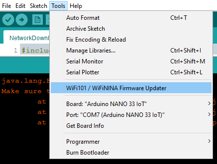
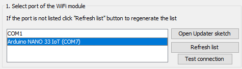
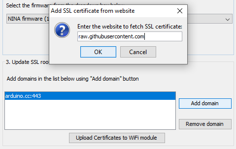
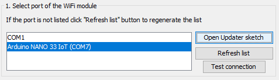

## _Voted† 100% better than Discord!*_

___

## Table of Contents

1. [Basic Info](#info)
2. [Components](#parts)
3. [Wiring Diagram](#diagram)
4. [Error Codes](#errortable)
5. [Getting Started in the Code](#gettingstarted)
6. [Usage Instructions](#instructions)
7. [Future Plans](#plans)
8. [Legal Info](#legal)

___

### **Basic Info**

What is glEEmail? Welcome to the future, kid. glEEmail is like sending your uncle a telegram, except it doesn't cost 25 cents per character. It's easy, and fun (some assembly required).

glEEmail allows you to securely‡ send messages to peers over the Internet via that old Morse Code switch that you have installed next to your computer terminal. Just hook it up and get flyin'!

Okay, for real, glEEmail is a side project while we're waiting for 200 SMD LEDs to arrive from China. The project allows you to test input and output from your Arduino, and to send messages to an Arduino at a different IP address as long as both can connect to the Internet.
___

### **Components**

We're testing glEEmail on an Arduino Nano 33 IoT, however it should work on any Arduino with WiFi capabilities (or any Arduino connected to a WiFi radio module, with minor modifications). If you're considering using glEEmail on a different Arduino, please make sure that it has sufficient space; glEEmail uses ~40,000 bytes of program storage space and ~3,200 bytes of dynamic memory with global variables. Additionally, please note that the Adafruit 4682 must be powered with 3.3V (it cannot run on 5V).

For the full parts list that we used (for a single user), please see the table below:

|Quantity|Component|
|-------------|:---|
|1x|Nano 33 IoT|
|1x|Breadboard|
|1x|54-410 Switch|
|2x|Crimp Connectors|
|1x|LCD HD44780|
|1x|270 Ω Resistor|
|1x|10k Ω Resistor|
|1x|10k Ω Potentiometer|
|1x|Adafruit 4682|
|1x|Micro SD Card|

___

### **Wiring Diagram**

[View Interactive Online Wiring Diagram (dark mode recommended)](https://app.diagrams.net/?src=about#HMatt-and-Gib%2Fgleemail%2Fmain%2Fwiring%20diagram.drawio)

For more information about wiring the LCD HD44780, we recommend [this tutorial from Ada Fruit](https://learn.adafruit.com/character-lcds/wiring-a-character-lcd)

___

### **Error Codes**

Last updated: 11/11/2021

0 - 9: General

|Code|Title|Notes|Severity|
|----|-----|-----|--------|
|0|None|No error was reported|N/A|
|1|Debug Debug Log|Verified that debug log is functional|N/A|
|2|Unknown Setup State|An unknown step was specified in setup|High|
|3|Continuous Frame Latency|Lag may cause inaccuracies in input|High|
|4|All Functions Succeeded||N/A|

10 - 49: Input Method

|Code|Title|Notes|Severity|
|----|-----|-----|--------|
|10|Morse Phrase Imminent Overflow|The Morse phrase is at capacity and must be committed without storing the provided dot/dash|High|
|12|Morse Code Lookup Failed|The entered combination of dots and dashes does not match any Morse Code pattern|Low|
|13|Morse Message To Send Reached Chat Complete Threshold|Entered message has reached the maximum length and must be sent immediately|Low|
|14|Morse Message To Send Exceeded Chat Complete Threshold|Entered message has exceeded the maximum length and must be sent immediately without storing the provided character|High|
|17|Commit Empty Message||High|
|18|Version Number Overflow||High|
|19|Morse Code Char Pairs Version Mismatch||Low|
|20|Message Only Whitespace||Low|

50 - 89: Network

|Code|Title|Notes|Severity|
|----|-----|-----|--------|
|51|Unknown Message Sender||High|
|52|Too Many Messages Received||High|
|53|Heartbeat Flatline|Too many consecutive heartbeats missing|High|
|54|Outgoing Token Timestamp Elapsed||High|
|57|Unknown Incoming Message Type||High|
|58|Confirmation No Match Found||Low|
|59|Duplicate Handshake||Low|
|60|Unexpected Handshake from Connected IP|Either received handshake after token removed from queue (expired) or handshake has unique idempotency token|Low|
|61|Heartbeat Stillborn|Heartbeat never received|High|
|62|Connection Attempt while Connected||Low|
|63|Authentication Failed|UserIP and PeerID not unique or peer signature invalid|High|
|64|Getting Messages Took Significantly Longer than Allocated||High|
|65|Getting Messages Took Insignificantly Longer than Allocated||Low|
|66|Processing Incoming Messages Took Significantly Longer than Allocated|Note: this will occur once when first authenticating peer and can be safely ignored|High|
|67|Processing Incoming Messages Took Insignificantly Longer than Allocated||Low|
|68|Sending Messages Took Significantly Longer than Allocated||High|
|69|Sending Messages Took Insignificantly Longer than Allocated||Low|
|70|Received Unauthentic Message|Decryption of chat message revealed it may have been tampered with (message will be discarded)|High|

90 - 129: JSON

|Code|Title|Notes|Severity|
|----|-----|-----|--------|
|90|Nullptr Payload|No data provided to deserialize|High|
|91|Prefs Deserialization Error|Could not read prefs file|High|
|92|Message Deserialization Error|Could not read message|High|
|93|Input Data Deserialization Error|Could not read downloaded data|High|

130 - 169: MessageError

|Code|Title|Notes|Severity|
|----|-----|-----|--------|
|130|None|No message error|N/A|

170 - 209: Internet Access

|Code|Title|Notes|Severity|
|----|-----|-----|--------|
|170|Passed Invalid Parameter|SSID or Password invalid|High|
|171|Connection Failed|May attempt retry|High|
|172|WiFi Connection Failed Retry Occurred||High|
|173|Unknown Status||High|
|174|SSID Possibly Truncated|Characters after SSID max length may have been missed|High|
|175|Password Possibly Truncated|Characters after Password max length may have been missed|High|
|176|Disconnected During Connection Attempt||High|

210 - 249: Web Access

|Code|Title|Notes|Severity|
|----|-----|-----|--------|
|210|Header Termination Omitted||High|
|211|Download Impossible: Not Connected||High|
|212|Secure Connection To Server Failed|SSL certificate may not be installed|High|
|213|Request to Server Header Invalid||High|
|214|Data Buffer Overflow||High|
|215|Data Buffer Underutilized||Low|

250 - 289: Storage

|Code|Title|Notes|Severity|
|----|-----|-----|--------|
|250|Prefs File Size Greater Than Prefs Document Size|Unable to read full prefs file from SD|High|
|251|Storage Not Detected|Verify that SD card is inserted correctly|High|
|252|Couldn't Load Prefs|Preferences file not found|Low|

___

### **Getting Started in the Code**

To-do...

[View Online Program Flow Diagram (dark mode recommended)](https://app.diagrams.net/?src=about#HMatt-and-Gib%2Fgleemail%2Fmain%2FglEEmail%20flow.drawio)

Required Libraries

- ArduinoJson by Benoit Blanchon
- hd44780 by Bill Perry
- WiFiNINA
- SD

Note: Do not use ASCII character 24 (cancel), it is reserved to prevent printing erroneous lines.

Steps to take after changing certain files

- preferences.h
	- Increment `PREFERENCES_VERSION` in `src/include/preferences.h`
	- Re-Calculate `CALCULATED_PREFS_SIZE` in `src/include/preferences.h`

- MorseCodeCharPairs.json (note: don't forget to update your `SERVER` and `SERVER_REQUEST` URLs to forked repo)
	- Increment `morseCodeCharPairsVersion` in `data/MorseCodeCharPairsVersion`
	- Re-Calculate `CALCULATED_MCCP_DOCUMENT_SIZE_IN_BYTES` in `data/MorseCodeCharPairs.json`

___

### **Usage Instructions**

Important!

In order to use glEEmail's Morse Code functionality, you will need to install the SSL certificate for `raw.githubusercontent.com` because the Morse-Code-to-character conversion uses a binary tree populated with JSON data hosted in this repository. To install the certificate, open the Arduino IDE, click on tools, then `WiFi101 / WiFiNINA Firmware Updater`, and make sure that your Arduino is selected in Step 1 of the Firmware Updater (Select the port of the WiFi Module).

Click on Open Updater Sketch, and upload the project that appears to your Arduino. Next, (back in the Firmware Updater) skip down to Step 3 of the Firmware Updater, click on Add domain, and paste the following: `raw.githubusercontent.com`.

Click OK, and you should see "raw.githubusercontent.com:443" in the table below "arduino.cc:443". Now, click on "Upload Certificates to WiFi Module." If you receive an error that the Programmer is not responding, make sure that the uploader sketch is uploaded on the Arduino first by clicking OK, then clicking "Open uploader sketch" back in Step 1 of the Firmware Updater, and uploading that to your Arduino before uploading any certificates.

• How to connect with your friend

If you've configured the hardware correctly, simply upload the code to your Arduino, open the serial monitor, and follow the prompts on screen (the LCD and serial monitor). If you haven't yet wired the hardware, refer to the [Wiring Diagram](#diagram).

• Features

- 57 ~~flavors~~ morse code characters
- You can hold down the switch to pause input
- DDoS protection built-in!
- Encrypted chat so you can't be spied upon‡
- Necessary downloads are cached to reduce network impact
- Learn Morse Code
- Easily send SOS when necessary‡
- Be social
- Be a glEEpal

***IMPORTANT NOTE:*** You are limited to sending no more than ~32,768 messages per session due to the size of the idempotency token (unsigned short- i.e. 2 bytes) and the necessity of confirmation messages. This decision was made to reduce message overhead and speed up encrypting and parsing. We understand that this limit will affect most users, and deeply apologize for the issue. There is simply nothing that we can do to change this, so just remember to power-cycle your glee-ware every once in a while.
___

### **Future Plans**

We'd like to implement additional input methods, including (but not limited to):

1. Phone app that connects directly to the Arduino, which also stores past messages.
2. Speech-to-text
3. Light-level
4. Web app
5. Dance-dance-revolution input
6. Game controller
7. Touch screen keyboard
8. Single-button random messages (magic 8 ball style)

___

### **Legal Info**

glEEmail is Open Source with no promise of support! Please feel free to contribute by submitting pull requests or issues. Contact us if you have any questions (or want to glEE-chat).

`†by glEEmail developers`

`*in terms of hardware** support`

`**Arduino`

`‡use at your own risk`
